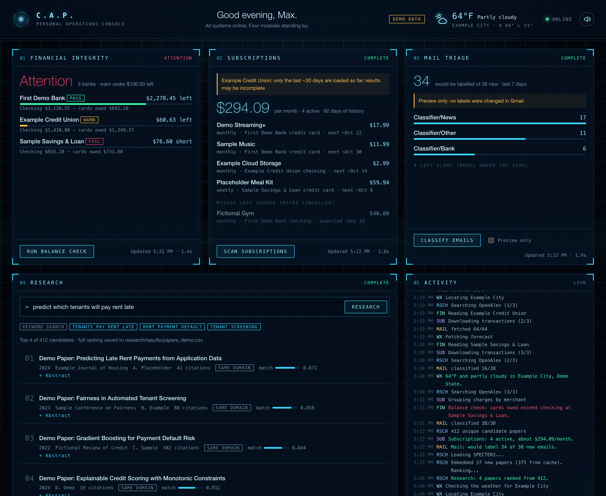
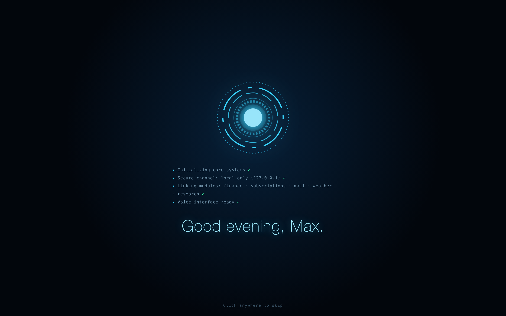
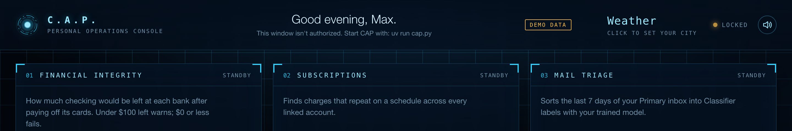

# C.A.P.

C.A.P. is a desktop dashboard that runs personal tools from one window: a bank-balance guardrail, a subscription detector, an ML email classifier and a research-paper search engine, plus live weather and a voice greeting. Everything runs on the local computer.



## Try it in 30 seconds

You need Python 3.12+ and [uv](https://docs.astral.sh/uv/). Demo mode uses made-up data, so no bank account, Gmail or API keys are needed.

```bash
git clone https://github.com/MaxTGH/cap.git
cd cap/cap
uv run demo.py
```

On a Mac with Chrome it opens as its own app window; anywhere else it opens in your browser.

## What's inside

| Module | What it does | Built with |
|---|---|---|
| [Financial integrity](balance-check/) | For each linked bank, shows how much checking would be left after paying off that bank's credit cards. **PASS** at $100+, **WARN** under $100, **FAIL** at $0 or below | Plaid API, macOS Keychain |
| [Subscriptions](balance-check/subscriptions.py) | Finds recurring charges in ~90 days of transactions, estimates the monthly total, and flags subscriptions that missed a charge (maybe cancelled) | Plaid Transactions, custom detection algorithm |
| Mail triage ([own repo](https://github.com/MaxTGH/email_classifier)) | Labels Gmail inbox with a fine-tuned DistilBERT model | PyTorch, Hugging Face Transformers, Gmail API |
| [Research](research/) | Describe an ML problem in plain English and get recent papers ranked by meaning | OpenAlex, SPECTER2 embeddings, optional Claude query expansion |
| Weather | Current conditions and today's high/low in the top bar | Open-Meteo |

<p align="center"></p>

## How it works

- **Every module is a standalone command-line tool** with a `--json` mode. Progress goes to stderr and the result is one line of JSON on stdout. Each still works on its own in a terminal.
- **CAP runs each module as a subprocess using that project's own virtualenv.** Heavy ML dependencies (PyTorch, Transformers) never load into the dashboard, and a crash in one module can't take it down.
- **The browser polls a small JSON API** for each job and streams progress lines into the live Activity log.

## Security and privacy design

The dashboard can trigger a live bank-balance check, so I designed it around what could go wrong:

| Threat | Mitigation |
|---|---|
| Something on the network reaches the dashboard | The server binds to `127.0.0.1` only |
| A website open in browser triggers a bank check (CSRF) | Every API call needs a random per-launch token. Other origins can't read the page, and requests with a foreign `Origin` are refused |
| DNS rebinding (an attacker's domain resolving to `127.0.0.1`) | Requests whose `Host` isn't `127.0.0.1`/`localhost` on CAP's port are refused |
| Another app or user account on the same Mac grabs the token | The token goes into the page exactly once, for the window CAP opens with a **single-use launch code**. Any other page load is locked |
| Command injection through the research prompt or city | Panels can only run a fixed list of commands. User text is validated and passed as a single argument after `--`, never through a shell |
| Malicious text in results (merchant names, paper titles) running as code (XSS) | Results are rendered only with DOM text APIs (never `innerHTML`), under a strict Content Security Policy (`script-src 'self'`, no inline scripts or styles) |
| Clickjacking | `frame-ancestors 'none'` |
| Secrets on disk or in git | Plaid keys and bank access tokens live in the macOS Keychain. Data, trained models and `.env` files are gitignored |
| Results lingering on disk | Results stay in memory only. Responses are sent with `Cache-Control: no-store`, nothing is logged, and the window uses its own browser profile |
| Data sent to third parties | Only the research prompt (OpenAlex) and the city name (Open-Meteo) leave the Mac. The voice uses on-device speech only |
| A fake Plaid Link callback during bank linking | `link.py`'s temporary local page checks `Host`/`Origin` and a one-time nonce |

<p align="center"><br><em>Any window that wasn't opened by CAP itself is locked.</em></p>

These protections are covered by [automated tests](cap/test_server.py) that start a real server and attack it over HTTP.

## Tests

```bash
(cd cap && uv run python -m unittest test_server -v)                          # server security and behavior (9 tests)
(cd balance-check && uv run python -m unittest discover -s test_scripts -v)   # balance rule and subscription detection (15 tests)
```

All tests use made-up data and never touch Plaid, Gmail or the Keychain.

## Repository layout

```
cap/             dashboard: server, launcher, demo, weather, UI (static/)
balance-check/   Plaid balance guardrail and subscription detector
research/        paper finder (CLI + notebook)
docs/            screenshots (demo data)
```

For the Mail triage panel in live mode, clone [email_classifier](https://github.com/MaxTGH/email_classifier) into this folder as `email-classifier/`.

## Running it for real

Live mode needs macOS (for the Keychain) and each module's own setup. See [balance-check](balance-check/README.md) (Plaid keys and bank linking), [research](research/README.md) and [cap](cap/README.md). Then:

```bash
cd cap && uv run cap.py
```

## Tech stack

Python, JavaScript, HTML/CSS · Plaid API · Gmail API · PyTorch · Hugging Face Transformers (DistilBERT, SPECTER2) · OpenAlex · Open-Meteo · macOS Keychain · uv
